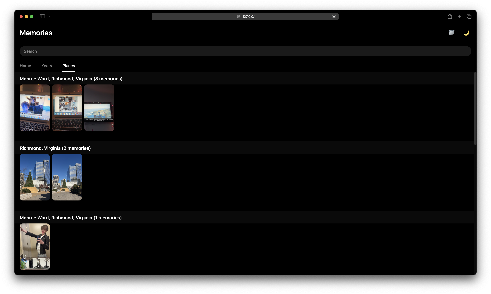

# Project-Memories

A way to download your Snapchat memories with the metadata and captions applied, then view them in a beautiful Snapchat-like interface. Relive your memories even if you can't pay to keep them on Snapchat!

## Features

- 📱 **Memories Like Interface** - Snapchat Memories like interface with a dark & light mode
- 🗓️ **Multiple View Modes** - Home, Years, and Places tabs to browse your memories
- 🔍 **Smart Search** - Search by date or location (Under Development)
- 🗺️ **Location Grouping** - Automatically groups memories by location with reverse geocoding
- 📅 **Year Grouping** - Organize and view memories by year
- 🎬 **Media Support** - View images and videos with full metadata
- 📊 **Detailed Metadata** - See date, media type, location, and filename for each memory
- ✨ **Flashbacks** - Get memory flashbacks just like in Snap!
- ⚡ **Fast Loading** - Just load the folder you downloaded and watch them all appear!

## Screenshots

<table>
  <tr>
    <td></td>
    <td></td>
    <td></td>
    <td></td>
  </tr>
  <tr>
    <td align="center">Home</td>
    <td align="center">Media Viewer</td>
    <td align="center">Places</td>
    <td align="center">Years</td>
  </tr>
</table>

## How to Use

### Step 1: Download Your Snapchat Memories Data

1. Go to [Snapchat Settings](https://accounts.snapchat.com/accounts/downloadmydata) and request your data
2. Snapchat will email you a download link with a JSON file containing all your memories metadata

### Step 2: Extract and Process Your Data

1. Run your JSON file through `download_snapchat_memories.py`:
   ```bash
   python download_snapchat_memories.py
   ```
   This will download all your memory media files

2. Run the downloaded folder through `apply_overlay_captions.py`:
   ```bash
   python apply_overlay_captions.py
   ```
   This adds captions and overlays to your memories (optional but recommended)

### Step 3: View Your Memories

1. Open `Memories-interface.html` in your web browser
2. Click the 📁 button to select your processed memories folder
3. Browse your memories!

## Search Tips (Feature currently not working)

- **By Date:** Type "2025", "December", "Dec 11", or any date format
- **By Location:** Type location names like "Monroe", "Richmond", "San Francisco", etc.
- **Partial Matches:** Just start typing and results will filter in real-time

## Interface Guide

- **Home Tab** - Flashbacks (4 most recent) and Recently Added memories
- **Years Tab** - Memories organized by year
- **Places Tab** - Memories grouped by location
- **Search Bar** - Filter across all tabs by date or location
- **🌙 Button** - Toggle between dark and light modes
- **📁 Button** - Select your memories folder

## Status: Under Development ⚠️

This project is still actively under development. Here's what to expect:

### Current State
- Basic memory browsing working
- Multiple view modes (Home, Years, Places)
- Location-based grouping and searching
- Date filtering

### Known Limitations
- May be slower with thousands of memories (optimization in progress)
- Some edge cases with date parsing
- Mobile responsiveness still being improved
- Search is not working
- Have to reload memories everytime you visit the site

### Upcoming Features & Improvements
- Performance optimization for large memory collections
- Enhanced search filters (media type, date range, etc.)
- Memory tagging and custom organization
- Export functionality
- Batch operations
- Improved mobile support
- Backend server for persistent storage
- Full web app deployment

## Important Notes

⚠️ **Performance:** If you have thousands of memories, the interface may be slower. I am actively working on optimization.

📝 **Data Privacy:** This tool runs entirely in your browser. Your memories never leave your device unless you explicitly share them.

## Requirements

- Modern web browser (Chrome, Firefox, Safari, Edge)
- Python 3.x (for downloading and processing memories)

## Feedback & Bug Reports

Found a bug or have a suggestion? Please let me know! I am actively developing this project and your feedback helps us improve.


