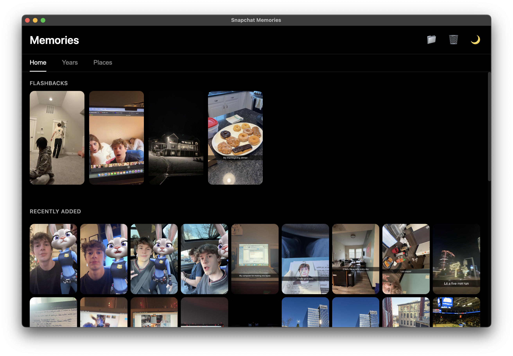
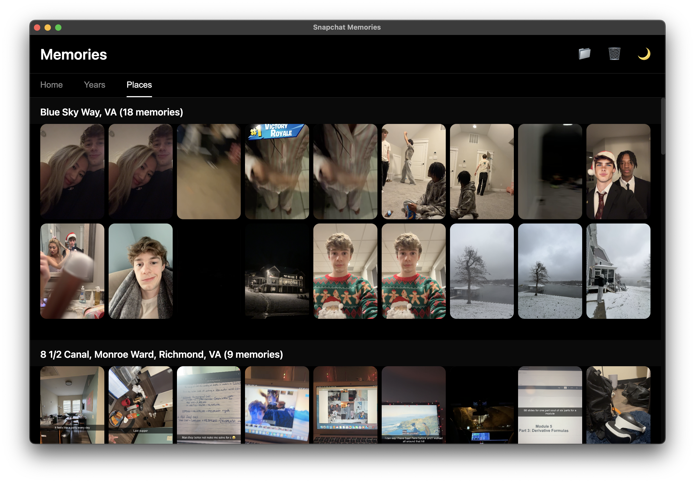
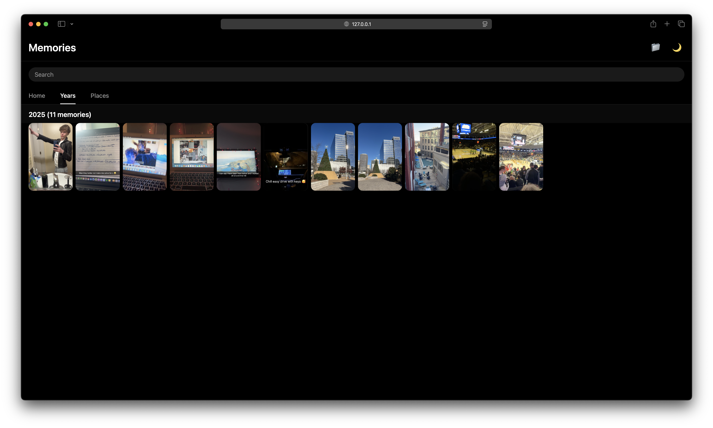

# Project-Memories

With Snapchat now making you pay to store your memories, I wanted to create an easy way for anyone to save and view their memories in an interface similar to the Snapchat experience we all love.

This repository includes Python scripts to download and curate your memories (preserving all metadata and captions) plus an Electron desktop app that provides a Snapchat-like interface for browsing your saved memories offline.

## ✨ Features

- 📱 **Snapchat-Like Interface** - Familiar dark & light mode UI
- 🗓️ **Multiple View Modes** - Home, Years, and Places tabs
- 🗺️ **Location Grouping** - Automatic reverse geocoding for place names
- 📅 **Year Organization** - Browse memories by year and month
- 🎬 **Full Media Support** - View images and videos with complete metadata
- ✨ **Flashbacks** - Random memory flashbacks just like Snapchat
- 🔒 **Privacy First** - Everything runs locally, your data never leaves your device

## Screenshots

<table>
  <tr>
    <td></td>
    <td></td>
    <td></td>
    <td></td>
  </tr>
  <tr>
    <td align="center">Home</td>
    <td align="center">Media Viewer</td>
    <td align="center">Places</td>
    <td align="center">Years</td>
  </tr>
</table>

## 🚀 Quick Start (For Users)

### Step 1: Install the App

**Download the latest release for your platform:**
- [Download for macOS](https://github.com/wyattx05/Project-Memories/releases)
- [Download for Windows](https://github.com/wyattx05/Project-Memories/releases)

#### macOS Installation

⚠️ **Important for Mac users:** Since this app is not signed with an Apple Developer certificate, you'll see a security warning. Here's how to open it:

**Method 1 (Easiest):**
1. Download and unzip the app
2. Drag "Snapchat Memories Viewer.app" to your Applications folder
3. **Right-click** (or Control-click) the app and select **"Open"**
4. Click **"Open"** again in the security dialog
5. The app will now open and be trusted for future use

**Method 2 (Terminal):**
```bash
# Navigate to where you saved the app
cd /Applications

# Remove the quarantine flag
xattr -cr "Snapchat Memories Viewer.app"

# Now you can open it normally
open "Snapchat Memories Viewer.app"
```

**Why does this happen?** This app is open-source and not signed with an Apple Developer account ($99/year). The app is completely safe - you can review the source code yourself!

#### Windows Installation

Download the installer and run it. Windows Defender might show a warning - click "More info" then "Run anyway."

#### Linux Installation

Download the AppImage, make it executable, and run:
```bash
chmod +x Snapchat-Memories-Viewer-*.AppImage
./Snapchat-Memories-Viewer-*.AppImage
```

### Step 2: Download Your Snapchat Data

1. Visit [Snapchat's Download My Data](https://accounts.snapchat.com/accounts/downloadmydata)
2. Request your data export
3. Download the JSON file from the email Snapchat sends you

### Step 3: Process Your Memories

Run the Python scripts in order:

```bash
# 1. Download all media files
python python/download_snapchat_memories.py <path-to-snapchat-json>

# 2. Add captions/overlays (optional)
python python/apply_overlay_captions.py <memories-folder>

# 3. Add location names (optional)
python python/add_location_names.py <memories-folder>
```

### Step 4: View Your Memories

1. Open the app and click the 📁 button
2. Select your processed memories folder
3. Enjoy your memories offline!

## 🛠️ Tech Stack

**Desktop App:**
- [Electron](https://www.electronjs.org/) - Cross-platform desktop framework
- JavaScript (ES6+) - Application logic
- HTML5/CSS3 - User interface
- Node.js - Backend file operations

**Python Scripts:**
- Python 3.x
- `requests` - API calls for reverse geocoding
- `Pillow` - Image processing for captions

**APIs:**
- [Nominatim](https://nominatim.org/) - OpenStreetMap reverse geocoding

## 💻 Development Setup

Want to modify the app or contribute? Here's how to get started:

### Prerequisites

- [Node.js](https://nodejs.org/) (v16 or higher)
- [Python 3.x](https://www.python.org/downloads/)
- Git

### Installation

1. **Clone the repository:**
   ```bash
   git clone https://github.com/yourusername/Project-Memories.git
   cd Project-Memories
   ```

2. **Install Node.js dependencies:**
   ```bash
   npm install
   ```

3. **Set up Python environment (optional, for scripts):**
   ```bash
   python3 -m venv .venv
   source .venv/bin/activate  # On Windows: .venv\Scripts\activate
   pip install -r python/requirements.txt
   ```

### Running in Development

**Start the Electron app:**
```bash
npm start
```

The app will launch in development mode with hot reloading.

## 📝 Python Script Usage

### download_snapchat_memories.py
Downloads all media files from Snapchat export JSON:
```bash
python python/download_snapchat_memories.py <snapchat-json-file>
```

### apply_overlay_captions.py
Adds captions and overlays to your memories:
```bash
python python/apply_overlay_captions.py <memories-folder>
```

### add_location_names.py
Adds precise location names via reverse geocoding:
```bash
python python/add_location_names.py <memories-folder> [--force]
```
- Use `--force` to re-process files that already have location names

## ⚠️ Current Limitations

- Performance may degrade with 10,000+ memories (optimization ongoing)
- Search functionality under development
- Some edge cases in metadata parsing

## 🔒 Privacy & Security

- **100% Local:** All processing happens on your device
- **No Tracking:** No analytics or telemetry
- **No Cloud:** Your memories never leave your computer
- **Open Source:** Fully auditable code

## 💡 Acknowledgments

- Inspired by the Snapchat Memories experience
- Uses OpenStreetMap's Nominatim for location data
- Built with Electron for cross-platform compatibility

---

**Note:** This is an independent project and is not affiliated with Snapchat Inc.